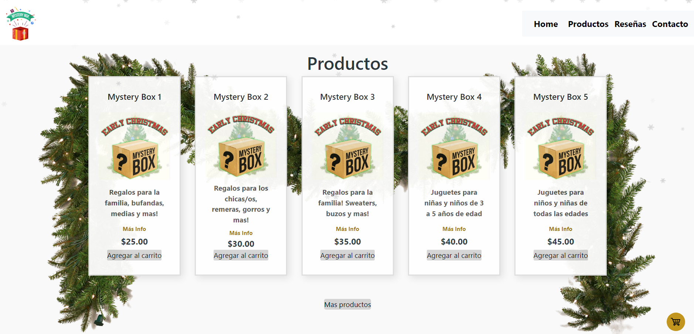

# Mystery Market

Este proyecto es una página web de e-commerce ficticia llamada **Mystery Market**. Fue desarrollado como parte de una entrega final para el curso _Buenos Aires Aprende_ del Gobierno de la Ciudad de Buenos Aires.

## Descripción

**Mystery Market** es una tienda en línea especializada en la venta de cajas de misterio. Los usuarios pueden explorar y comprar diferentes tipos de cajas con sorpresas adentro, cada una diseñada para diferentes gustos y preferencias. La página incluye secciones de productos, reseñas de clientes y un formulario de contacto.

## Capturas de Pantalla

 <!-- Agrega una captura de pantalla aquí si es posible -->

## Estructura del Proyecto

Este proyecto contiene las siguientes secciones principales:

1. **Header**: Incluye el logotipo de la página y un menú de navegación que permite al usuario desplazarse entre las secciones.
2. **Productos**: Muestra una lista de cajas de misterio disponibles para la compra, cada una con una breve descripción y su precio.
3. **Reseñas**: Presenta reseñas de clientes sobre las diferentes cajas de misterio.
4. **Contacto**: Formulario que permite a los usuarios enviar mensajes al equipo de Mystery Market.
5. **Footer**: Contiene los derechos de autor y el logotipo del proyecto

## Tecnologías Utilizadas

- **HTML5**: Estructura del contenido y diseño general de la página.
- **CSS3**: Estilos y diseño visual de la página.
- **Formspree**: Integración para el formulario de contacto, que permite el envío de mensajes a través de correo electrónico.

## Archivos y Directorios

- `index.html`: Archivo principal que contiene el HTML de la página web.
- `styles.css`: Archivo de estilos CSS para la personalización visual del sitio.
- `img/`: Carpeta que contiene imágenes utilizadas en la página (logo, productos, etc).